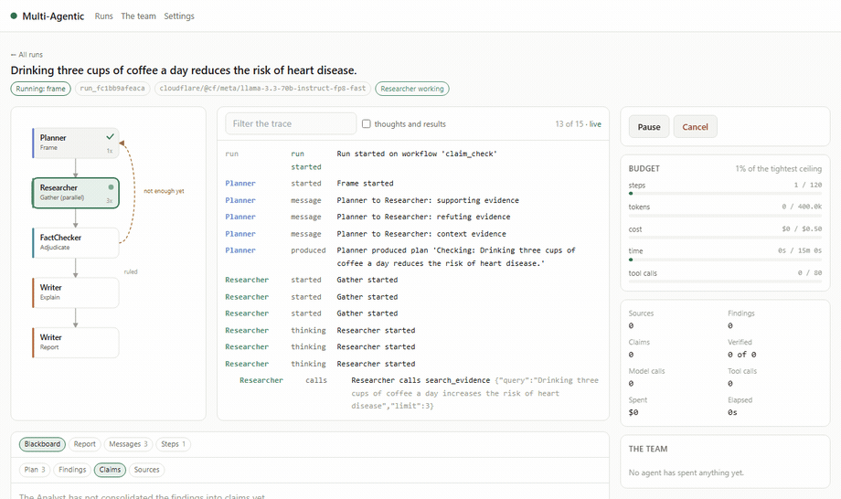
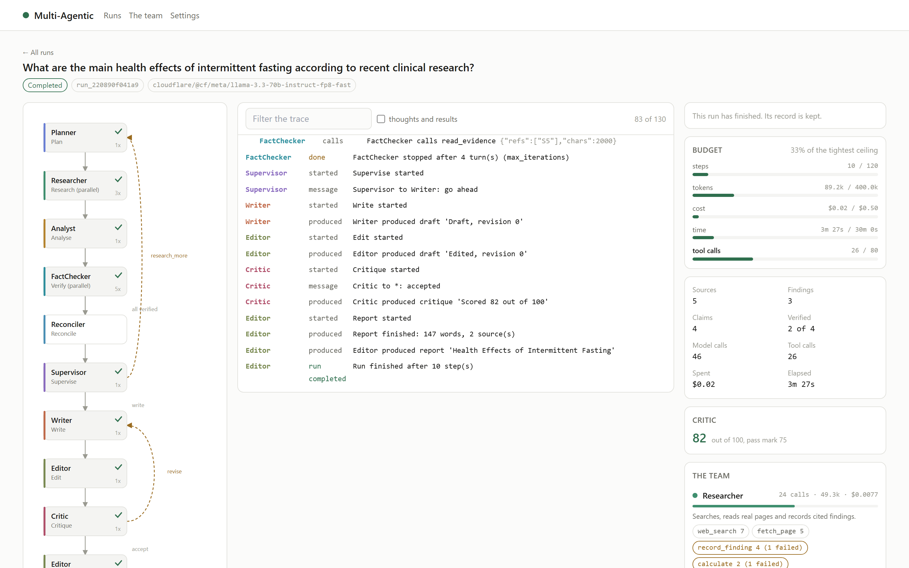
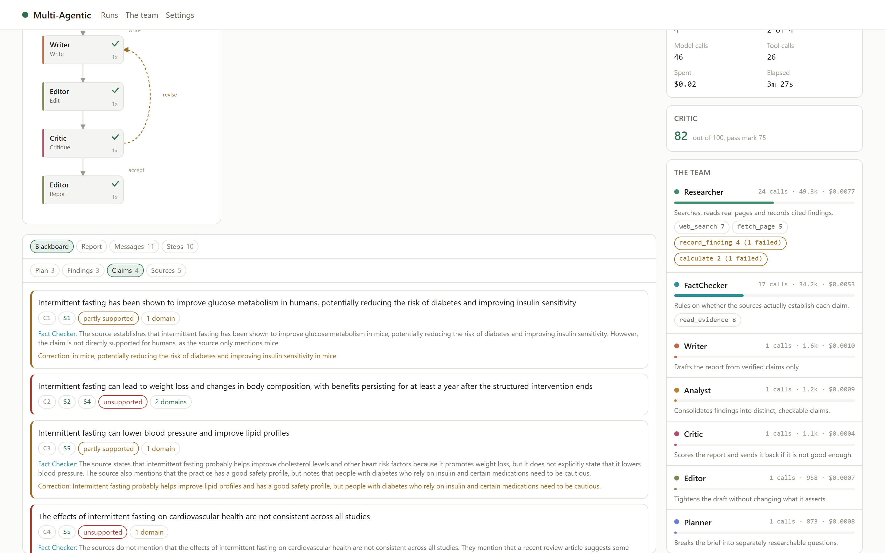
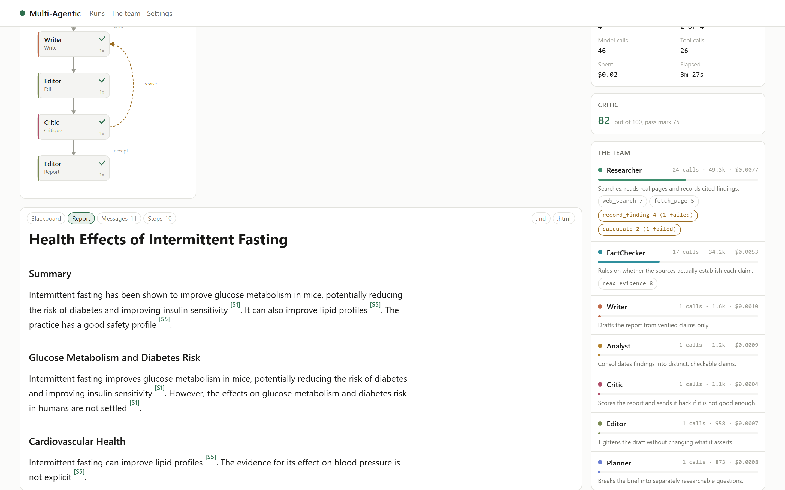
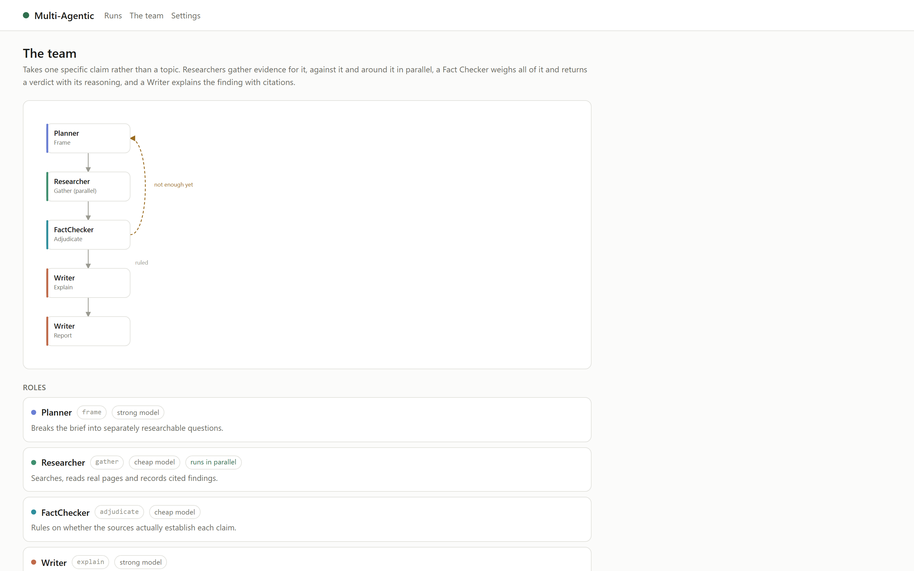
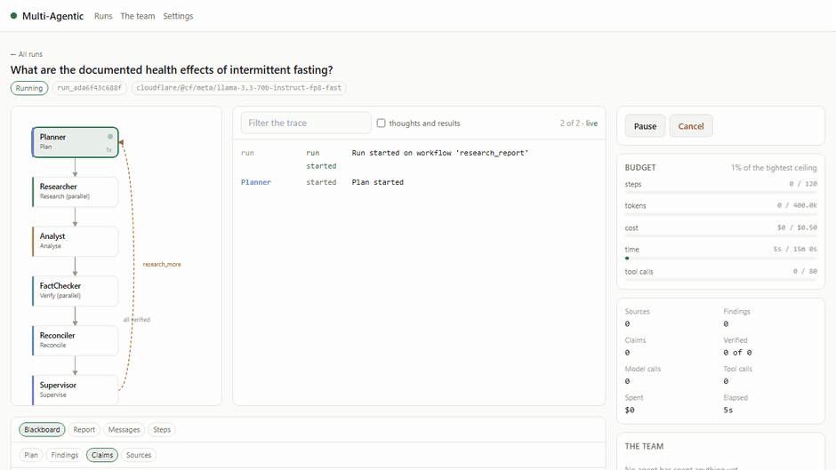

<div align="center">

# Multi-Agent Fact Verifier

**A supervised team of LLM agents that researches a question on the open web, checks every claim against the sources it actually read, and writes a cited report.**

Claims that fail verification never reach the report. The ones that do carry their sources, and the report says what was thrown out and why.

[](https://www.python.org/)
[](https://nextjs.org/)
[](https://fastapi.tiangolo.com/)
[](#every-model-provider)
[](#tests)
[](LICENSE)

</div>

---



*Nine roles, real tool calls, live cost per agent. Nothing here is scripted: the trace is the run.*

---

## Why this exists

Most "AI research agent" projects are a prompt chain wearing a costume: one model, called four times, described in agent vocabulary. This one is built so the claim survives inspection.

|  | How you can check |
|---|---|
| **Nine roles, not one prompt** | Each has its own model tier, its own tools, its own prompt. The per-agent cost table shows who actually did the work |
| **Agents choose their own actions** | A reason-and-act loop. Every tool call is recorded with its arguments and its result in the `tool_calls` table |
| **They collaborate, not chain** | A shared blackboard and a message bus. `mas messages <run>` prints who told whom what |
| **Verification deletes, not flags** | A claim the Fact Checker rejects never reaches the Writer. The report lists the exclusions |
| **Contradiction is detected** | Vectors find claims about the same subject; a Reconciler rules on only those pairs |
| **Two feedback loops** | The Supervisor can send researchers back out; the Critic can send the draft back. Both bounded by counters |
| **Runs survive the process** | Queue and blackboard checkpointed after every step. Pause on one machine, resume on another |

## The workflows

Two graphs on one kernel. Adding the second one required no change to the orchestrator, the blackboard, the budget guard or the UI.

<table>
<tr><th width="55%">research_report — takes a topic</th><th width="45%">claim_check — takes one claim</th></tr>
<tr valign="top"><td>

```
   Planner ─────────────────────┐
      │ subquestions            │
   Researcher × N  (parallel)   │
      │ findings                │ gaps
   Analyst                      │
      │ claims                  │
   FactChecker × N  (parallel)  │
      │ verdicts                │
   Reconciler                   │
      │ conflicts               │
   Supervisor ──────────────────┘
      │ write
   Writer ◄────────────┐
      │                │
   Editor              │ revise
      │                │
   Critic ─────────────┘
      │ accept
   Report
```

</td><td>

```
   Planner
      │ three angles
   Researcher × 3  (parallel)
      │ for it, against it,
      │ around it
   FactChecker
      │ verdict + confidence
   Writer
      │
   Report
```

Deliberately three separate searches. One agent asked to "research this claim" searches for the claim and finds only the confirming half.

About 5× cheaper than a full report. Good for a quick check.

</td></tr>
</table>

## What a run produces

<table>
<tr>
<td width="50%"></td>
<td width="50%"></td>
</tr>
<tr>
<td><b>The run, live.</b> Agent graph on the left with the current node lit, the trace in the middle, budget and per-agent spend on the right.</td>
<td><b>Every claim, with its verdict.</b> The Fact Checker's actual reasoning, the independent outlets behind it, and corrections where a claim overstated its source.</td>
</tr>
<tr>
<td></td>
<td></td>
</tr>
<tr>
<td><b>The report.</b> Every factual sentence cited, a real source list, and a "how this was checked" section with the exclusions named.</td>
<td><b>The roster.</b> Drawn from the running graph, so it cannot drift from the system it describes.</td>
</tr>
</table>

### A real excerpt

From an actual run, unedited. Note that it refuses to state the well-known consensus, because it could not verify it from sources it read:

> ## What the evidence says
> * Intermittent fasting is unlikely to cause significant loss of lean body mass, especially with moderate to high protein intake [S1].
> * Infrequent meal feeding and prolonged fasting may be suboptimal for supporting muscle protein remodeling [S2].
>
> ## How this was checked
> - Verdict: **unverifiable**
> - Confidence in this ruling: high
> - Independent outlets behind the ruling: 2 (dietdoctor.com, frontiersin.org)

The supporting search found a source saying fasting does not cost muscle. The refuting search found a peer-reviewed paper saying it may. The Fact Checker ruled the comparison unverifiable rather than picking a side.

## Stopping costs nothing

This is the part most agent projects do not have, and it is why the run loop looks the way it does.



Every ceiling **pauses** a run rather than killing it. So does a spent free-tier quota. Everything gathered stays on the blackboard, and you continue when you want to.

```bash
mas run "..."                       # Ctrl+C pauses. It does not lose work.
mas pause  <run>                    # from anywhere, including another process
mas resume <run>                    # continues from the last completed step
mas resume <run> --max-usd 2        # raise a ceiling and carry on
mas resume <run> --provider groq    # your provider ran out? continue on another
```

A run started in the terminal can be paused from the browser and resumed by a scheduled job, because a run lives in the database rather than in a process.

## Watching what it costs

Built to run on free tiers, so the accounting is not an afterthought.

| Ceiling | Default | What it stops |
|---|---|---|
| `--max-steps` | 120 | runaway graphs |
| `--max-tokens` | 400,000 | the usual way a budget goes |
| `--max-usd` | 0.50 | paid providers only; free tiers price at zero |
| `--max-seconds` | 1800 | a run that has stalled |
| `--max-tool-calls` | 80 | a researcher that will not stop searching |

Below the ceiling it degrades rather than failing: past 70 percent the strong roles drop to the cheap model and the Planner asks fewer questions, so you get a smaller finished report instead of a larger unfinished one.

**Typical cost on free tiers:** a claim check runs about 90 seconds and 30k tokens. A full report runs 3 to 5 minutes and 80 to 120k tokens. On Gemini, Groq or Cloudflare free tiers that is $0.00.

## Every model provider

Nineteen, behind one interface. **One key is enough to run the whole team.**

| | |
|---|---|
| **Free tier** | Google Gemini · Groq · Cloudflare Workers AI · Cerebras · SambaNova |
| **Paid** | OpenAI · Anthropic · Mistral · DeepSeek · Together · Fireworks · xAI · Perplexity · OpenRouter · Hugging Face |
| **Local, no key** | Ollama · LM Studio · llama.cpp · vLLM |

Roles are assigned a *tier*, not a model, so one key configures everyone:

| Tier | Roles | Why |
|---|---|---|
| cheap | Researcher, FactChecker, Supervisor | high volume, mechanical judgement |
| strong | Planner, Analyst, Writer, Editor, Critic | once or twice a run, sets the quality of everything |

Tool calling uses each provider's **native function calling** where it exists (the 16 OpenAI-compatible adapters) and a **JSON protocol in the prompt** everywhere else. Both paths are tested, because a bug in one is invisible from the other.

## Quick start

```bash
git clone https://github.com/spearb0lt/Multi-Agent-Fact-Verifier.git
cd Multi-Agent-Fact-Verifier

# Python
uv venv --python 3.12 .venv           # or: python -m venv .venv
.venv/Scripts/pip install -r requirements.txt     # Linux/macOS: .venv/bin/pip

# Keys. Every one is optional.
cp .env.example .env

# Check the machine can actually do the work
python -m mas.cli doctor --model
```

```
Multi-Agentic doctor

runtime tier   server
database       ok  sqlite, 0 run(s) stored
llm providers  ok  4 available
search         ok  keyed: serpapi, tavily, exa | keyless: googlenews, wikipedia
embeddings     ok  onnx, 384 dimensions
tools          ok  calculate, fetch_page, list_evidence, read_evidence,
                   recall, record_finding, remember, search_evidence, web_search
model call     ok  {'ok': True}

ready
```

Then run the team:

```bash
python -m mas.cli run "What did the RBI decide at its last policy meeting, and why?"
python -m mas.cli run "Coffee reduces heart disease risk." --workflow claim_check
```

**It works with no keys at all.** Google News and Wikipedia answer queries without a credential, the bundled ONNX model deduplicates evidence locally, and Ollama or LM Studio can drive the agents.

### The web UI

```bash
npm install
npm run build          # exports the frontend into out/
python -m mas.main     # serves the API and the UI on http://localhost:8000
```

One process, one port, one origin. For frontend development instead:

```bash
python -m mas.main --reload     # API on 8000
npm run dev                     # UI on 3000
```

## Reading a run

```bash
mas list                     # every run, with its spend
mas status   <run>           # spend per agent, tool usage, ceilings
mas messages <run>           # who told whom what
mas trace    <run>           # the full event log
mas show     <run>           # the report
mas show     <run> --html --out report.html
```

## Free tier notes

Free tiers are limited by **tokens per minute** far more tightly than by requests, which is the thing that actually stops a run. The pacer respects both:

```
PROVIDER_RPM=gemini:12,groq:25
PROVIDER_TPM=groq:7000,gemini:200000
```

A quota that runs out mid run pauses it rather than failing it. Wait for the window, or switch:

```bash
mas resume <run> --provider cloudflare
```

## Deployment

The Python process serves the API and the built UI, so there is one thing to deploy.

| Target | How |
|---|---|
| **Docker** | `docker compose up --build` |
| **Render** | The included `render.yaml` creates a web service with a 1 GB disk |
| **Oracle Cloud, any VM, a Pi** | `pip install -r requirements.txt && python -m mas.main` |

The disk matters: checkpoints are what make runs resumable.

**Vercel is not supported and the code is deliberately not shaped for it.** An agent run takes minutes and must survive between requests. A serverless function is killed at a fixed deadline and has an ephemeral filesystem, so the checkpoint that lets a run continue would have nowhere to live.

## Tests

```bash
python -m pytest
```

68 tests, and they spend nothing. They cover the kernel's guarantees (pause, resume, budget breach, lease exclusion, retries, approval gates, requeue of interrupted work), both tool-calling protocols, argument coercion, rate pacing, and the prose extraction that keeps a navigation menu from being stored as a source.

## Layout

```
mas/core/        19 providers, embeddings, web access, storage, cost metering
mas/kernel/      blackboard, bus, budget, pacer, tools, reason-and-act loop,
                 semantic layer, graph, orchestrator
mas/agents/      one module per role
mas/workflows/   roles wired into a graph
mas/tools/       what an agent may actually do
mas/api/         FastAPI, and the worker that runs a run in the background
app/ components/ lib/    the Next.js UI
tests/           the kernel's guarantees, without spending a token
```

[`docs/architecture.md`](docs/architecture.md) explains where each agentic property lives, and why the run loop is a state machine over a queue rather than a call chain.

[`CLAUDE.md`](CLAUDE.md) holds the conventions and a list of the bugs that cost real time to find. Worth reading before changing the kernel.

## License

MIT. See [LICENSE](LICENSE).
